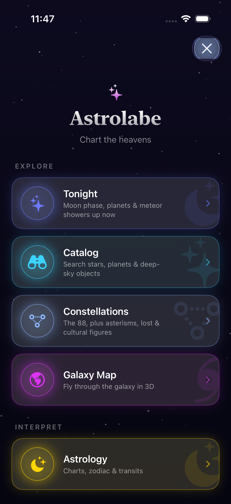
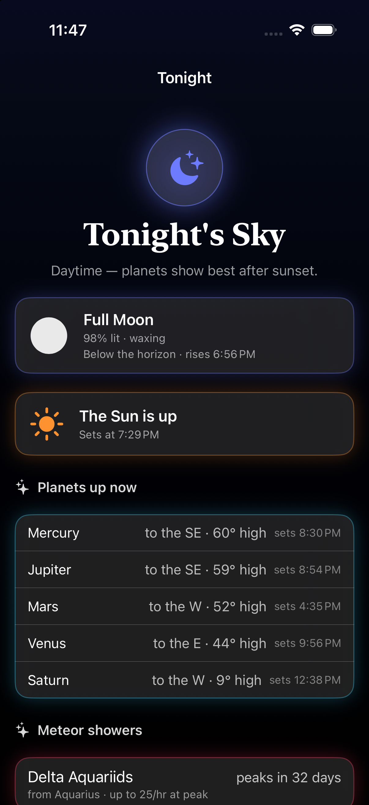
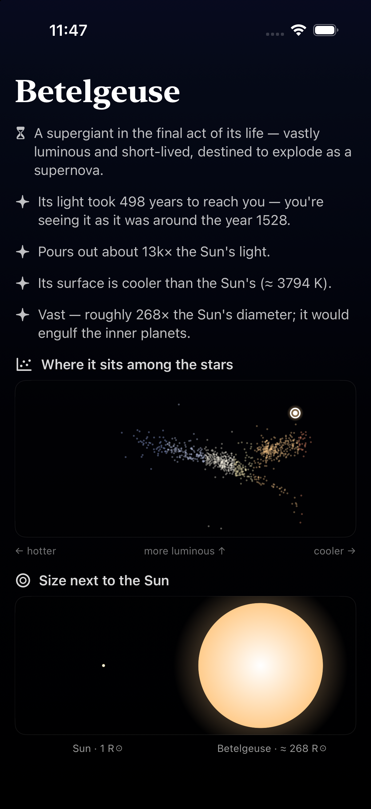
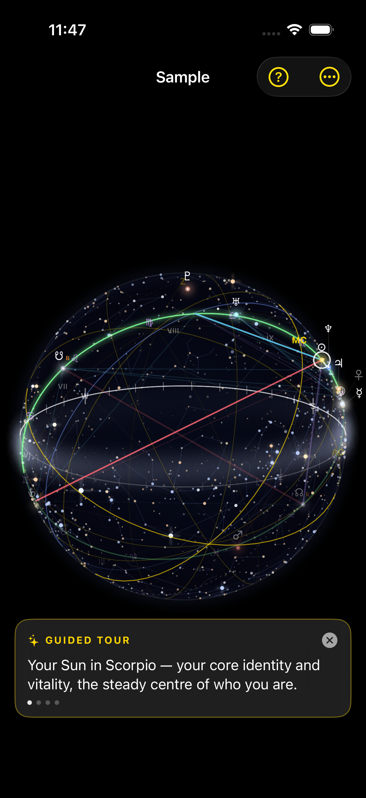
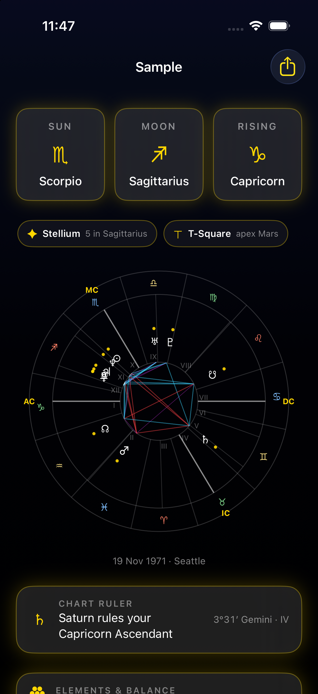
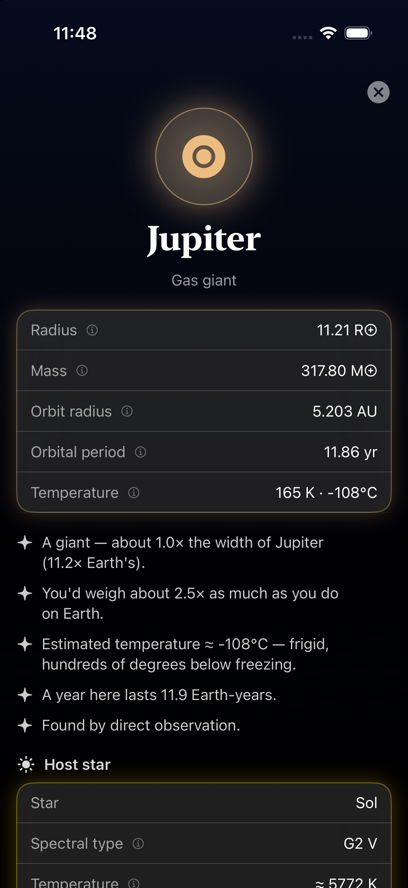

<div align="center">

# Astrolabe

**A point-at-the-sky planetarium for iOS — with deep astrophysical data and a full astrology layer, built to be genuinely beautiful.**

Raise your phone toward the sky to see the real positions of stars, planets, and other
celestial bodies, accurately computed for your location and the current instant. Tap anything
for as much detail as exists — physical *and* astrological. Then leave Earth entirely and fly
through a 3D map of the galaxy.

<sub>iOS · Swift 6 (strict concurrency) · SwiftUI + Metal · *“Astrolabe” is a working title*</sub>

</div>

---

## The three pillars

1. **Accurate** — real ephemeris math and real catalogs. Positions are validated against
   published reference values (Meeus’ worked examples, JPL Horizons) and aim to match
   Stellarium / SkySafari within reason.
2. **Deep** — every body carries the richest dataset we can source. Tapping always rewards
   curiosity: spectral class, temperature, luminosity, light-travel time, orbital elements,
   exoplanets — and, in a clearly separate layer, signs, houses, aspects and transits.
3. **Beautiful** — the differentiator. Smooth motion, glowing star fields, a volumetric Milky
   Way, tasteful typography, and considered transitions throughout.

Astrophysics and astrology **coexist but never blend in code** — different math, different data,
different UI surfaces. The user chooses what they want to see.

---

## A look

<table>
  <tr>
    <td align="center"><br><sub><b>The hub</b> — Explore & Interpret</sub></td>
    <td align="center"><br><sub><b>Tonight</b> — what’s up right now</sub></td>
    <td align="center"><br><sub><b>Star detail</b> — numbers → intuition</sub></td>
  </tr>
  <tr>
    <td align="center"><br><sub><b>3D celestial sphere</b> — your sky as a globe</sub></td>
    <td align="center"><br><sub><b>Natal chart</b> — wheel, patterns, readings</sub></td>
    <td align="center"><br><sub><b>Planet detail</b> — physical facts, relatably</sub></td>
  </tr>
</table>

---

## What it does

### 🔭 Two ways to see the sky
- **Sky mode** — stand on Earth and raise your phone; the real bodies project onto the celestial
  dome (RA/Dec → alt/az for your location and time) via CoreMotion. Pinch to zoom, tap any star
  to identify it.
- **AR mode** — the same sky overlaid on the live camera (ARKit), with a manual calibration nudge
  for sub-degree heading.
- The full naked-eye star catalog (HYG, mag ≤ 6.5), constellation stick-figures, the Sun & Moon
  (Moon with topocentric parallax + atmospheric refraction), an opt-in **ecliptic & zodiac
  overlay** showing the live planets at their true sky positions, and a **±12 h time scrubber**.

### 🌌 Galaxy Map — fly through the galaxy in 3D
- The real local star field: ~25k HYG stars at their true 3D positions (parallax → parsecs), Sun
  at the origin. Orbit, pinch, or engage **free-flight** and cruise hands-free.
- A stylized, true-scale **Milky Way** (four-arm barred spiral) with volumetric nebulae — ten of
  them **image-baked from real visible-light photos** (Orion, Eagle, Lagoon, Crab, Veil, Ring…),
  plus clusters, satellite galaxies and black holes.
- **Exoplanets** from the NASA Exoplanet Archive: fly to a host star and open its planetary
  system. Rendered entirely through a custom **Metal** sprite pipeline (camera-relative
  coordinates + logarithmic depth) with an octree for picking and frustum culling.
- *(There may or may not be a black hole to fall into.)*

### ✨ Tonight
The Moon’s phase, day/night with sunrise & sunset, which naked-eye planets are up (with where to
look and when they rise/set), active **meteor showers**, and upcoming **astronomical events**
(solstices, oppositions, eclipses…) — all computed locally on the live ephemeris.

### 📖 Catalog & Constellations
Search stars, planets and deep-sky objects with rich detail pages — including an **HR-diagram
“you are here”** and a true-scale **Sun-vs-star** silhouette. Browse all **88 IAU constellations**
plus asterisms, historical figures and cultural skies, each with a **“constellations are a
line-of-sight illusion”** 3D view that pulls the flat pattern apart in real depth.

### 🌙 Astrology — a real natal app on the same sky engine
- Birth charts (geocoded place → coordinates + IANA timezone), the **Big Three**, a full chart
  wheel, positions with **dignities**, the aspectarian, and **chart-shape patterns** (stellium,
  grand trine, T-square, grand cross, yod).
- An **owned, deterministic interpretation engine** (no licensed corpus, no runtime generation) —
  tap any placement, aspect or pattern for a sectioned reading.
- **Transits**, **secondary progressions**, **solar & lunar returns**, **synastry & composite**
  charts, daily readings, and retrograde alerts.
- A mesmerizing **3D celestial sphere** of any chart — the real star field, the zodiac belt, the
  houses and the aspect chords as a luminous rotating globe, with a guided tour and time travel.
- Export a chart as a shareable poster, or render a sphere rotation to GIF/MP4.

House systems: Whole Sign · Equal · Porphyry · **Placidus**. Zodiac: tropical or sidereal (Lahiri).

---

## Architecture

The math and data are kept **platform-agnostic and unit-tested**, fully isolated from UI and
sensors.

```
App/                  SwiftUI iOS app (Swift 6, strict concurrency) + the Metal galaxy renderer
  Sky/                sensors, AR, projection (SkyCamera / SkyMotionProvider / ARCameraController)
  Screens/            Tonight, Catalog, Constellations, Galaxy Map, Astrology, About
  Charts/             chart wheel, the 3D celestial sphere, editor, transits, synastry…
  Catalog/            catalog data + “relatable” facts (StarFacts, Landmarks, Glossary…)
Packages/
  CelestialCore/      pure astronomy engine — NO UIKit/SwiftUI deps
    Time/             Julian date, sidereal time, ΔT, nutation
    Coordinates/      equatorial ⇄ horizontal, precession, refraction
    Catalog/          HYG stars, Messier/NGC deep-sky
    Ephemeris/        Sun & Moon (Meeus), planets Mercury–Pluto (SwiftAA), minor bodies, events
    Astrophysics/     derived stellar radius, light-travel, unit conversions
    Spatial/          PointOctree for the galaxy map
  Astrology/          zodiac, ayanamsa, angles, houses, aspects, charts — depends only on CelestialCore
project.yml           XcodeGen spec — the .xcodeproj is generated, not committed
```

- **`CelestialCore`** is pure computation: feed it a time + observer + body, get back coordinates
  and physical data. `Sendable`, free of global mutable state, and unit-tested against known
  references.
- **`Astrology`** depends on `CelestialCore` (it needs ecliptic longitudes); nothing depends on it.
- The app layer turns engine output into the rendered dome, the galaxy, and the detail UI.

Deeper design notes live in [`CLAUDE.md`](CLAUDE.md) and the per-feature specs in [`docs/`](docs/).

---

## Build & run

The Xcode project is generated by [XcodeGen](https://github.com/yonaskolb/XcodeGen) from
`project.yml`, so it isn’t committed.

```sh
brew install xcodegen      # once
xcodegen generate          # writes Astrolabe.xcodeproj
open Astrolabe.xcodeproj
```

Run the engine’s tests:

```sh
cd Packages/CelestialCore && swift test
cd Packages/Astrology     && swift test
```

> **Star catalog data.** The bundled naked-eye catalog ships in `App/Resources/`. The full
> [HYG database](https://github.com/astronexus/HYG-Database) (~120k stars, ~34 MB) is **not**
> committed — fetch it into a git-ignored `Data/` directory only if you’re regenerating catalogs
> (see `tools/`).

---

## Data sources & licensing

Built on open data, with attribution surfaced in-app under **About → Sources**:

- **Stars** — HYG Database (Hipparcos/Yale/Gliese; public domain).
- **Deep-sky** — Messier / NGC; landmark positions via SIMBAD/CDS.
- **Exoplanets** — NASA Exoplanet Archive.
- **Sun / Moon / planets** — our own Meeus implementations + **SwiftAA** (MIT) for planet
  longitudes; physical facts from NASA/JPL fact sheets.
- **Constellation lines** — d3-celestial (Frohn, BSD). **Nebula imagery** — ESA/Hubble & ESO
  (CC BY 4.0), used only to derive particle datasets; the source photos are never bundled.

Notably, **no Swiss Ephemeris** (AGPL/commercial) — the astrology math is rolled in-house on
`CelestialCore`, so the whole stack is App-Store-clean.

---

## Status & roadmap

The astronomy engine, the AR/Sky views, the Galaxy Map (Metal), the full constellation browser,
and a deep astrology module are all working. Current focus is ship-readiness and the next layer of
polish — see [`CLAUDE.md`](CLAUDE.md) for the full roadmap and [`docs/`](docs/) for design specs,
including planned work on [preferences](docs/preferences-spec.md),
[widgets](docs/widgets-spec.md), [onboarding](docs/onboarding-spec.md),
[accessibility](docs/accessibility-spec.md) and [localization](docs/localization-spec.md).

<div align="center"><sub>Made with care, pointed at the sky.</sub></div>
